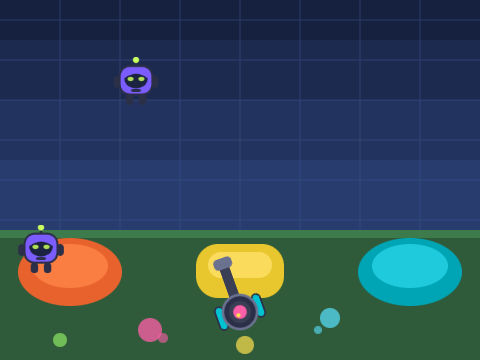

# Пейнтбол — игра для Scratch 3

Готовый проект Scratch: `paintball.sb3`. Файл можно сразу загрузить на scratch.mit.edu
или открыть в офлайн-редакторе Scratch Desktop.



## Играть в браузере без аккаунта

В папке `web/` лежит самодостаточная страница-«автомат»: она загружает этот же
`paintball.sb3` в официальный движок Scratch (`scratch-vm` + `scratch-render`),
рисует табло очков/жизней/времени и принимает мышь, клавиатуру и касания.

```bash
cd web
mkdir -p vendor                       # сборки движка не хранятся в репозитории
npm install scratch-vm scratch-render scratch-storage
cp node_modules/scratch-vm/dist/web/scratch-vm.js            vendor/scratch-vm.js
cp node_modules/scratch-render/dist/web/scratch-render.min.js vendor/scratch-render.js
cp node_modules/scratch-storage/dist/web/scratch-storage.min.js vendor/scratch-storage.js
python3 build_web.py                  # вшивает .sb3 и заставку в index.html
```

Дальше `index.html` открывается прямо в браузере. Редактировать нужно
`web/page.template.html` — `index.html` собирается из него.

## Как открыть и опубликовать на scratch.mit.edu

1. Скачать `paintball.sb3`.
2. Зайти на https://scratch.mit.edu под своим аккаунтом и открыть редактор:
   https://scratch.mit.edu/projects/editor/
3. Меню **Файл → Загрузить из компьютера** и выбрать `paintball.sb3`.
4. Дать проекту имя и нажать **Поделиться** — после этого появится ссылка вида
   `https://scratch.mit.edu/projects/XXXXXXXXX/`.

## Управление

| Действие | Клавиши |
|---|---|
| Прицеливание | мышь |
| Выстрел | пробел или зажатая кнопка мыши |
| Движение турели | ← → или A / D |

## Правила

Боты-мишени спускаются сверху. За каждое попадание +1 очко, каждый прорвавшийся
вниз бот отнимает жизнь. Партия длится 60 секунд или до потери всех 5 жизней.
Чем выше счёт, тем быстрее спускаются боты.

## Устройство проекта

| Спрайт | Роль |
|---|---|
| **Маркер** | турель игрока: целится на мышь, ездит вдоль нижнего края, создаёт клоны шарика |
| **Шарик** | клон-снаряд: летит к прицелу, при попадании превращается в кляксу |
| **Мишень** | бот: клонируется сверху, спускается, при попадании даёт очко, при прорыве отнимает жизнь |
| **Сцена** | таймер партии, переменные Очки / Жизни / Время, конец игры |

Переменные `Очки`, `Жизни`, `Время` показаны на экране.

## Пересборка

`paintball.sb3` собирается скриптом — руками его править не нужно:

```bash
python3 build_sb3.py
```

Скрипт генерирует SVG-костюмы, собирает блоки Scratch 3 через небольшой DSL
и упаковывает `project.json` с костюмами в zip-архив `.sb3`.
Зависимостей нет, нужен только Python 3.

## Как проект проверялся

* официальный `scratch-parser` (им сайт Scratch читает загружаемые проекты) — проект принят;
* запуск в реальном движке `scratch-vm` в Chromium с WebGL-рендерером Scratch:
  костюмы отрисовываются, попадания считаются попиксельно, партия доигрывается до конца;
* автотест прошёл 30 секунд игры: 27 попаданий, жизни на месте, ошибок движка нет;
* проверены клавиши ← → / A / D, ограничение турели по краям сцены и экран финала.
